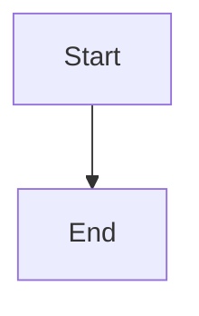
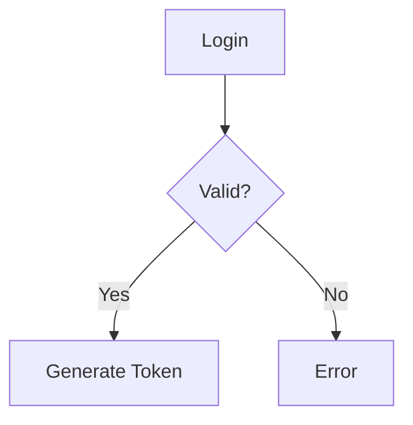
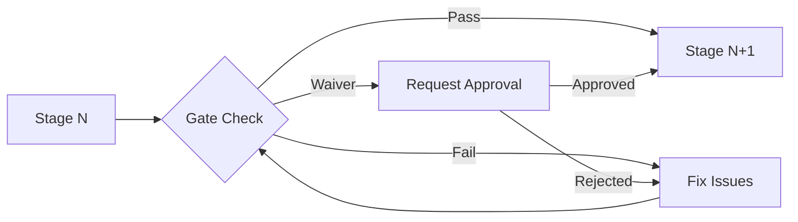
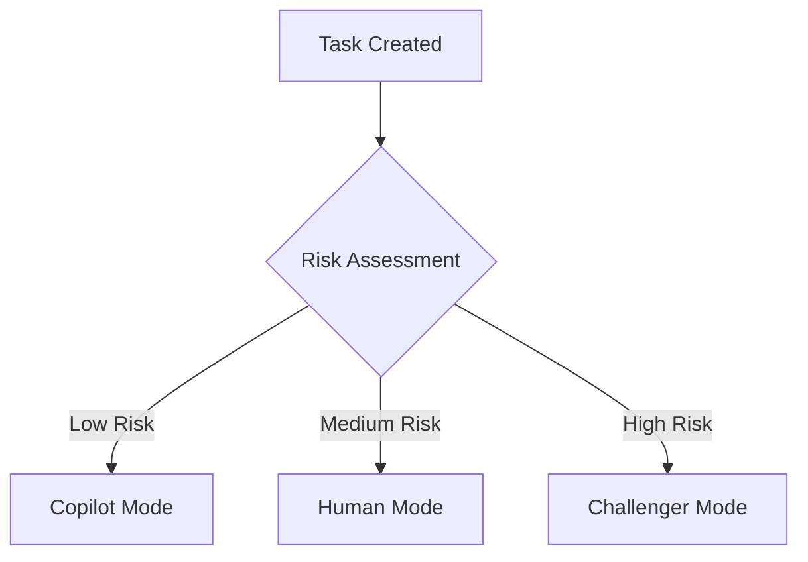
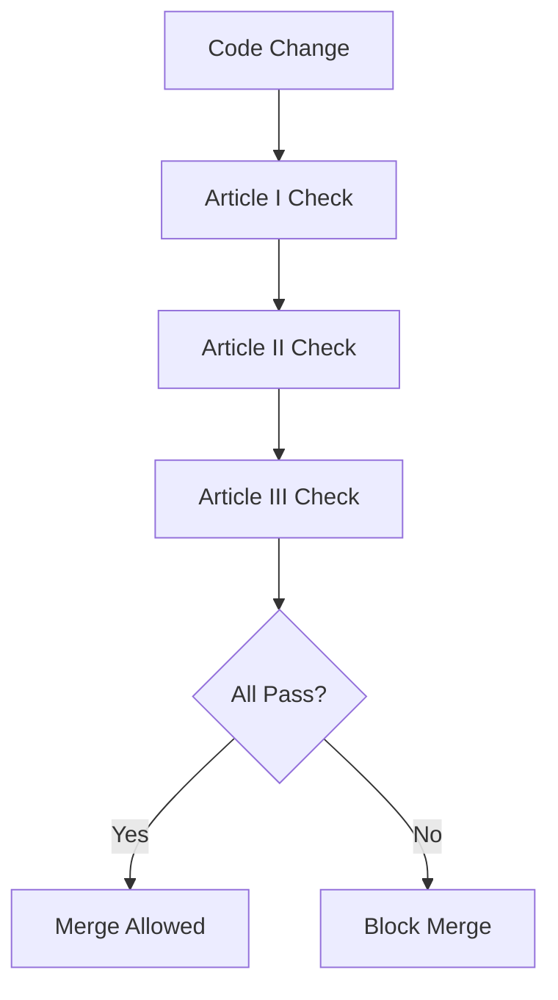
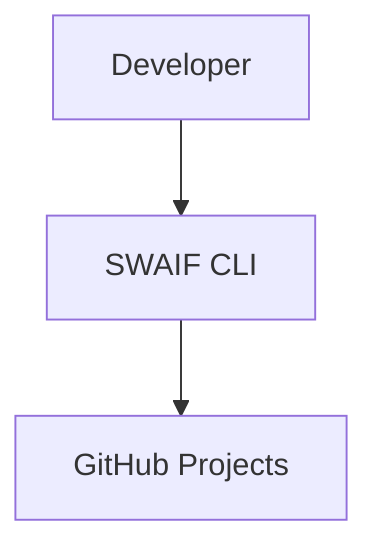
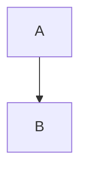

# SWAIF Visual Diagrams

**Comprehensive architectural and workflow visualizations for the SWAIF system**

This directory contains Mermaid diagrams that illustrate the structure, behavior, and processes of the Software Architecture with Intelligent Frameworks (SWAIF) methodology.

---

## Overview

The diagrams are organized into two categories:

1. **Architecture Diagrams** - System structure, components, and deployment views
2. **Workflow Diagrams** - Process flows, sequences, and decision trees

All diagrams use [Mermaid](https://mermaid.js.org/) syntax for consistency, version control, and easy rendering.

---

## How to Render Mermaid Diagrams

### Option 1: GitHub (Automatic)

GitHub automatically renders `.mmd` files and Mermaid code blocks in Markdown:

```markdown

```

### Option 2: VS Code

Install the [Mermaid Preview Extension](https://marketplace.visualstudio.com/items?itemName=bierner.markdown-mermaid):

```bash
code --install-extension bierner.markdown-mermaid
```

Then open any `.mmd` file or markdown with Mermaid blocks and preview with `Ctrl+Shift+V` (Windows/Linux) or `Cmd+Shift+V` (Mac).

### Option 3: Online Tools

- **Mermaid Live Editor:** https://mermaid.live/
  - Paste diagram code
  - Real-time preview
  - Export to PNG/SVG

- **Kroki:** https://kroki.io/
  - Supports multiple diagram formats
  - API for automated rendering

### Option 4: Command Line

Install the Mermaid CLI:

```bash
npm install -g @mermaid-js/mermaid-cli

# Render single diagram
mmdc -i diagrams/architecture/system-context.mmd -o system-context.png

# Render all diagrams
for file in diagrams/**/*.mmd; do
  mmdc -i "$file" -o "${file%.mmd}.png"
done
```

### Option 5: Documentation Sites

Most modern documentation generators support Mermaid:

- **MkDocs:** Use [mkdocs-mermaid2-plugin](https://github.com/fralau/mkdocs-mermaid2-plugin)
- **Docusaurus:** Built-in support via [@docusaurus/theme-mermaid](https://docusaurus.io/docs/markdown-features/diagrams)
- **Sphinx:** Use [sphinxcontrib-mermaid](https://github.com/mgaitan/sphinxcontrib-mermaid)

---

## Architecture Diagrams

Located in `architecture/` directory.

### System Context Diagram
**File:** `architecture/system-context.mmd`  
**Type:** C4 Context Diagram  
**Purpose:** Shows SWAIF's position in the broader software ecosystem

Illustrates:
- External actors (developers, stakeholders, CI/CD systems)
- SWAIF system boundary
- Integration points (GitHub, cloud providers, observability platforms)
- Information flows

**Use When:** Explaining SWAIF to executives, architects, or new team members who need the "big picture."

---

### System Overview
**File:** `architecture/system-overview.mmd`  
**Type:** Flowchart  
**Purpose:** High-level system architecture showing major subsystems

Shows:
- User interfaces (Delivery Board, Automation CLI, PR Checks)
- Core services (Stage Orchestrator, Gate Rules Evaluator, Risk Engine, Audit Log)
- Data services (Policy Config, Work Items, Evidence Store, Telemetry DB)
- Information and control flows

**Use When:** Understanding high-level system architecture or explaining core SWAIF components.

---

### Component Architecture
**File:** `architecture/component-architecture.mmd`  
**Type:** C4 Component Diagram  
**Purpose:** Detailed internal structure of SWAIF system

Shows:
- All major components (CLI, orchestrator, stage engines, validators)
- Layered architecture (presentation, application, domain, infrastructure)
- Component dependencies and communication patterns
- Data stores and external service integrations

**Use When:** Designing extensions, debugging system behavior, or onboarding engineers.

---

### Deployment View
**File:** `architecture/deployment-view.mmd`  
**Type:** Deployment Diagram  
**Purpose:** Physical/logical deployment architecture

Covers:
- Execution environments (local dev, CI/CD, cloud)
- Containerization strategy
- Network topology
- Persistence layers
- Observability stack

**Use When:** Planning infrastructure, troubleshooting deployment issues, or documenting production setup.

---

### Control Plane Structure
**File:** `architecture/control-plane.mmd`  
**Type:** Component Diagram  
**Purpose:** GitHub Projects-based orchestration layer

Details:
- GitHub Projects as the control plane
- Issue/PR lifecycle management
- Automation workflows (GitHub Actions)
- State persistence strategy
- Label-based stage tracking

**Use When:** Understanding how SWAIF integrates with GitHub, customizing workflows, or debugging automation.

---

### Control Flow
**File:** `architecture/control-flow.mmd`  
**Type:** Flowchart  
**Purpose:** Governance and control flow between stakeholders and systems

Details:
- Executive sponsors defining governance priorities
- Product managers submitting initiative requests
- Delivery teams providing implementation updates
- QA/Security reviewers making validation decisions
- Evidence collection and telemetry feedback loops

**Use When:** Understanding stakeholder interactions or explaining governance model.

---

### State Machine
**File:** `architecture/state-machine.mmd`  
**Type:** State Diagram  
**Purpose:** Complete state machine for the six-stage workflow

Defines:
- All six stages (INTAKE → SPECIFY → PLAN → TASKS → IMPLEMENT → VERIFY)
- Transition conditions (gate approvals)
- Entry/exit actions
- Error states and recovery paths
- Waiver/exception handling

**Use When:** Implementing stage logic, validating gate criteria, or understanding failure scenarios.

---

## Workflow Diagrams

Located in `workflows/` directory.

### Development Lifecycle
**File:** `workflows/development-lifecycle.mmd`  
**Type:** Sequence Diagram  
**Purpose:** End-to-end interaction flow for a complete feature

Traces:
- Developer actions
- SWAIF CLI commands
- System responses
- Gate approvals
- Deployment to production

**Use When:** Training new developers, documenting process, or analyzing bottlenecks.

---

### Daily Workflow
**File:** `workflows/daily-workflow.mmd`  
**Type:** Flowchart  
**Purpose:** Developer's typical day using SWAIF

Outlines:
- Morning routine (sync, check status)
- Task selection logic
- Implementation modes (Copilot/Human/Challenger)
- Testing and commit flow
- End-of-day procedures

**Use When:** Onboarding developers, creating training materials, or optimizing daily processes.

---

### Stage Transitions
**File:** `workflows/stage-transitions.mmd`  
**Type:** Decision Tree  
**Purpose:** Gate approval decision logic

Maps:
- Exit criteria for each stage
- Approval conditions
- Rejection paths
- Waiver request process
- Compensating controls

**Use When:** Debugging gate failures, customizing criteria, or documenting approval process.

---

### Challenger PR (Parallel Implementation)
**File:** `workflows/challenger-pr.mmd`  
**Type:** Flowchart  
**Purpose:** Adversarial review process for high-risk changes

Shows:
- Proposer AI implementation
- Challenger AI attack vectors
- Debate/revision cycles
- Human arbitration
- Approval/rejection outcomes

**Use When:** Implementing security-critical features, understanding Challenger mode, or auditing high-risk decisions.

---

### Risk Analysis Workflow
**File:** `workflows/risk-analysis.mmd`  
**Type:** Flowchart  
**Purpose:** Risk assessment and execution mode selection

Details:
- Risk factor evaluation (complexity, criticality, novelty)
- Automatic mode selection (Copilot/Human/Challenger)
- Override mechanisms
- Audit trail creation
- Compliance checks

**Use When:** Calibrating risk thresholds, auditing execution decisions, or configuring project-specific rules.

---

## Diagram Conventions

### Colors and Styling

We use consistent color coding across diagrams:

| Color | Meaning | Usage |
|-------|---------|-------|
| **Green** | Success, approval, compliant | Approved gates, passing tests |
| **Red** | Failure, rejection, violation | Failed gates, errors, blocks |
| **Yellow/Orange** | Warning, review needed | Pending approval, manual review |
| **Blue** | Information, process | Standard workflow, data flow |
| **Purple** | High importance | Critical paths, security |
| **Gray** | Inactive, optional | Unused features, alternatives |

### Node Shapes

- **Rectangle:** Process or action
- **Diamond:** Decision point
- **Circle/Ellipse:** Start/end state
- **Parallelogram:** Input/output
- **Hexagon:** External system
- **Cylinder:** Database/storage

### Arrow Styles

- **Solid line:** Primary flow
- **Dashed line:** Optional/async flow
- **Thick line:** Critical path
- **Dotted line:** Metadata/annotation

---

## Editing Guidelines

When creating or modifying diagrams:

### 1. Syntax Validation

Always validate syntax before committing:

```bash
# Install mermaid-cli if not already installed
npm install -g @mermaid-js/mermaid-cli

# Validate diagram
mmdc -i your-diagram.mmd -o test.png

# If successful, diagram is valid
```

### 2. Complexity Management

Keep diagrams focused:

- **Maximum nodes:** 20-30 per diagram
- **Maximum depth:** 5 levels of nesting
- **Subgraphs:** Use to group related components
- **Split when needed:** Break large diagrams into multiple focused views

### 3. Labeling Standards

- **Node labels:** Clear, concise (< 5 words)
- **Edge labels:** Action or condition
- **Subgraph titles:** Category or layer name
- **IDs:** Use semantic names (`userAuth` not `n1`)

### 4. Comments

Add comments for complex sections:



### 5. Versioning

- Update diagrams when code changes affect architecture
- Document major changes in commit messages
- Keep diagram version comments:

```mermaid
---
title: System Context Diagram
version: 2.1.0
last_updated: 2024-01-15
---
```

---

## Common Patterns

### Pattern 1: Stage Gate Flow



### Pattern 2: Execution Mode Selection



### Pattern 3: Constitutional Validation



---

## Troubleshooting

### Issue: Diagram Not Rendering

**Problem:** Mermaid syntax error or unsupported feature

**Solutions:**
1. Check syntax at https://mermaid.live/
2. Verify Mermaid version compatibility
3. Escape special characters (`#`, `[`, `]`, `{`, `}`)
4. Use quotes for complex labels: `["Complex (Label)"]`

### Issue: Diagram Too Complex

**Problem:** Diagram unreadable or cluttered

**Solutions:**
1. Split into multiple diagrams (by layer, by flow)
2. Use subgraphs to group related nodes
3. Increase detail level progressively (context → container → component)
4. Create a simplified "overview" version

### Issue: Performance Problems

**Problem:** Large diagrams slow to render

**Solutions:**
1. Reduce node count (< 50 nodes)
2. Simplify styling
3. Use PNG exports for documentation
4. Consider splitting diagram

---

## Integration with Documentation

### Embedding in Markdown

```markdown
# Architecture Overview

The following diagram shows the system context:


```

### Linking from Documentation

```markdown
For detailed architecture, see:
- [System Context](../diagrams/architecture/system-context.mmd)
- [Component View](../diagrams/architecture/component-architecture.mmd)
```

### Automated Documentation Generation

Use tools like `mermaid-cli` in CI/CD to generate PNG exports:

```yaml
# .github/workflows/docs.yml
- name: Generate Diagram Images
  run: |
    npm install -g @mermaid-js/mermaid-cli
    find diagrams -name "*.mmd" -exec mmdc -i {} -o {}.png \;
```

---

## Contributing

When adding new diagrams:

1. **Choose appropriate type:** Flowchart, sequence, state, class, etc.
2. **Follow naming convention:** `kebab-case-description.mmd`
3. **Add to this README:** Document purpose and use cases
4. **Validate syntax:** Test rendering before committing
5. **Update related docs:** Link from relevant guides

### Quality Checklist

- [ ] Diagram renders correctly in GitHub
- [ ] All nodes have descriptive labels
- [ ] Critical paths clearly marked
- [ ] Legend included if using custom styling
- [ ] Comments explain complex sections
- [ ] Listed in this README with description
- [ ] Linked from relevant documentation

---

## Resources

### Mermaid Documentation
- **Official Docs:** https://mermaid.js.org/intro/
- **Syntax Reference:** https://mermaid.js.org/intro/syntax-reference.html
- **Examples Gallery:** https://mermaid.js.org/ecosystem/integrations.html

### Diagram Types
- **Flowchart:** https://mermaid.js.org/syntax/flowchart.html
- **Sequence:** https://mermaid.js.org/syntax/sequenceDiagram.html
- **State:** https://mermaid.js.org/syntax/stateDiagram.html
- **Class:** https://mermaid.js.org/syntax/classDiagram.html
- **ER:** https://mermaid.js.org/syntax/entityRelationshipDiagram.html
- **Gantt:** https://mermaid.js.org/syntax/gantt.html
- **C4:** https://mermaid.js.org/syntax/c4c.html

### Tools
- **Mermaid Live Editor:** https://mermaid.live/
- **Mermaid CLI:** https://github.com/mermaid-js/mermaid-cli
- **VS Code Extension:** https://marketplace.visualstudio.com/items?itemName=bierner.markdown-mermaid

---

## License

These diagrams are part of the SWAIF documentation and are licensed under Apache 2.0.

---

**Maintained by the SWAIF Core Team**  
_Last Updated: 2024 | SWAIF v1.0.0_
# SWAIF Diagram Suite

This directory contains architecture and workflow diagrams for the SWAIF framework.

## Diagram Index

### Architecture (`diagrams/architecture/`)
- `system-context.mmd` — C4 Context diagram showing external actors and core SWAIF platform context
- `system-overview.mmd` — High-level system architecture showing major subsystems and data flow
- `component-architecture.mmd` — Detailed internal components and layered architecture
- `deployment-view.mmd` — Physical and logical deployment topology  
- `control-plane.mmd` — GitHub Projects-based governance and orchestration layer
- `control-flow.mmd` — Governance control flow between stakeholders and systems
- `state-machine.mmd` — Complete six-stage initiative lifecycle state machine

### Workflows (`diagrams/workflows/`)
- `development-lifecycle.mmd` — End-to-end sequence from problem intake to production deployment
- `daily-workflow.mmd` — Developer daily operating loop with all execution modes
- `stage-transitions.mmd` — Complete gate approval decision trees for all 6 stages
- `challenger-pr.mmd` — Adversarial review process for high-risk changes
- `risk-analysis.mmd` — Risk factor evaluation and execution mode selection

### Poster
- `POSTER.md` — plain-text ASCII visual summary of all diagrams.

## Rendering Instructions

### Option A: Mermaid CLI (recommended)

```bash
# one-time (if needed)
npm install -g @mermaid-js/mermaid-cli

# render one diagram
mmdc -i diagrams/architecture/system-context.mmd -o diagrams/out/system-context.svg

# render all diagrams
mkdir -p diagrams/out
for f in diagrams/architecture/*.mmd diagrams/workflows/*.mmd; do
  base="$(basename "$f" .mmd)"
  mmdc -i "$f" -o "diagrams/out/${base}.svg"
done
```

### Option B: Markdown Preview
- Open any `.mmd` in an editor/extension that supports Mermaid.
- Or embed diagrams in Markdown fenced blocks:

````markdown

````

## Local Validation

Use Mermaid CLI parse-and-render as a syntax validation step:

```bash
mkdir -p diagrams/out
for f in diagrams/architecture/*.mmd diagrams/workflows/*.mmd; do
  base="$(basename "$f" .mmd)"
  mmdc -i "$f" -o "diagrams/out/${base}.svg"
done
```

If all files render successfully, Mermaid syntax is valid.
