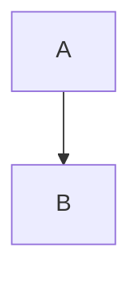

# SWAIF Diagram Suite

This directory contains architecture and workflow diagrams for the SWAIF framework.

## Diagram Index

### Architecture (`diagrams/architecture/`)
- `system-context.mmd` — external actors and core SWAIF platform context.
- `component-architecture.mmd` — internal components and data flow.
- `deployment-view.mmd` — runtime deployment topology.
- `control-plane.mmd` — governance and policy control interactions.
- `state-machine.mmd` — initiative life-cycle state machine.

### Workflows (`diagrams/workflows/`)
- `development-lifecycle.mmd` — end-to-end lifecycle from intake to learning.
- `daily-workflow.mmd` — daily team operating loop.
- `stage-transitions.mmd` — explicit gate criteria by stage.
- `challenger-pr.mmd` — pull request challenger/reviewer decision flow.
- `risk-analysis.mmd` — risk identification, scoring, and mitigation flow.

### Poster
- `POSTER.md` — plain-text ASCII visual summary of all diagrams.

## Rendering Instructions

### Option A: Mermaid CLI (recommended)

```bash
# one-time (if needed)
npm install -g @mermaid-js/mermaid-cli

# render one diagram
mmdc -i diagrams/architecture/system-context.mmd -o diagrams/out/system-context.svg

# render all diagrams
mkdir -p diagrams/out
for f in diagrams/architecture/*.mmd diagrams/workflows/*.mmd; do
  base="$(basename "$f" .mmd)"
  mmdc -i "$f" -o "diagrams/out/${base}.svg"
done
```

### Option B: Markdown Preview
- Open any `.mmd` in an editor/extension that supports Mermaid.
- Or embed diagrams in Markdown fenced blocks:

````markdown

````

## Local Validation

Use Mermaid CLI parse-and-render as a syntax validation step:

```bash
mkdir -p diagrams/out
for f in diagrams/architecture/*.mmd diagrams/workflows/*.mmd; do
  base="$(basename "$f" .mmd)"
  mmdc -i "$f" -o "diagrams/out/${base}.svg"
done
```

If all files render successfully, Mermaid syntax is valid.
